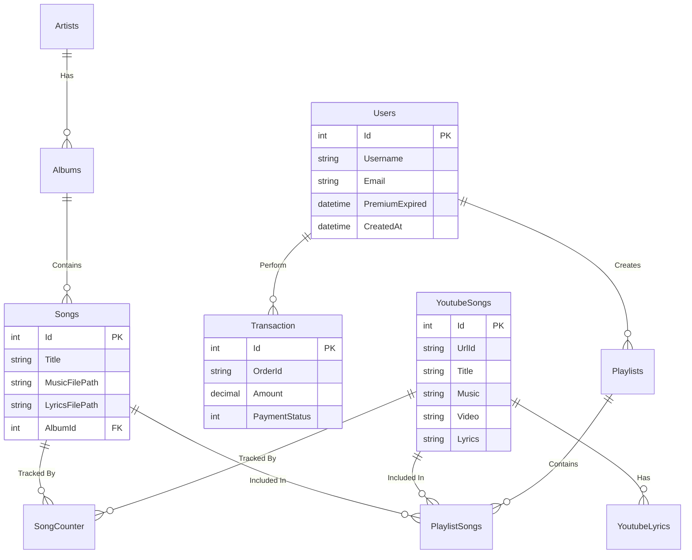
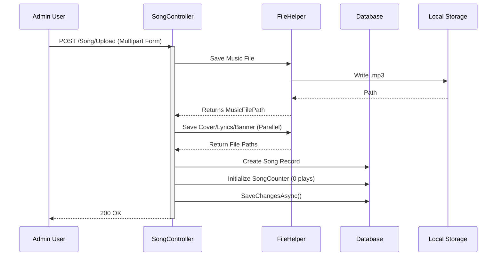
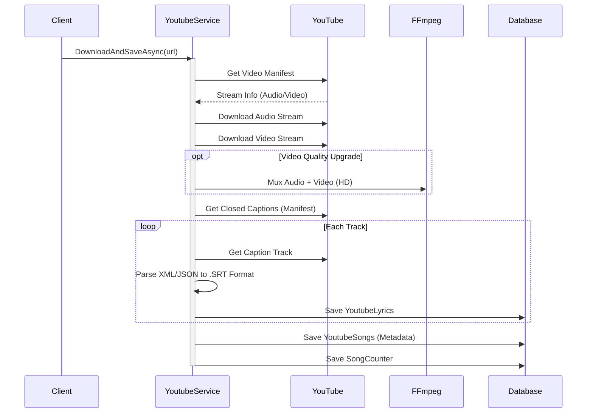
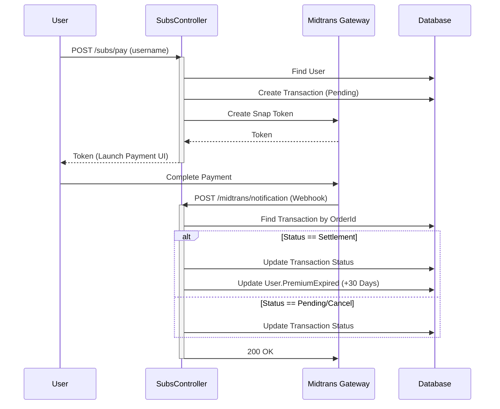
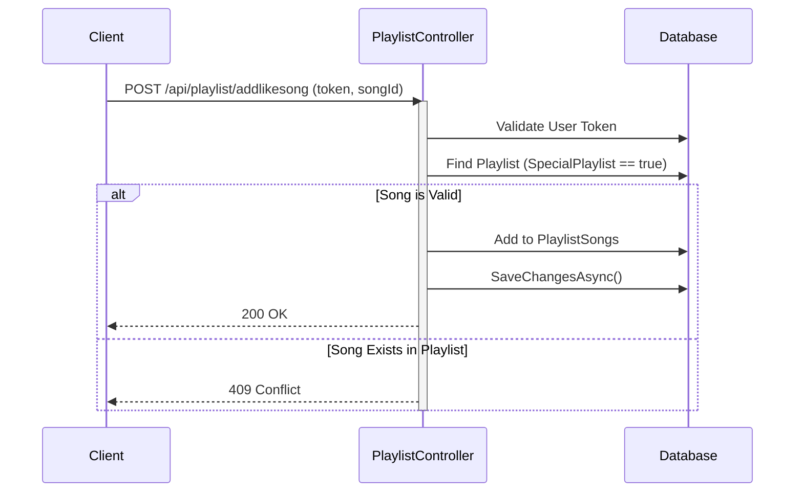

# Software Design Report: Floatly Server

## 1. Executive Summary
**Floatly Server** is a high-performance media streaming and management server built on **ASP.NET Core (.NET 10)**. It is designed to serve as a centralized backend for music clients, offering features such as local library management, YouTube audio/video integration, real-time lyrics synchronization, and a premium subscription model handled via **Midtrans**.

## 2. Technology Stack

### Backend Core
*   **Framework**: ASP.NET Core (.NET 10 Preview)
*   **Language**: C#
*   **Database ORM**: Entity Framework Core 9.0.9
*   **Databases**:
    *   **Development**: Microsoft SQL Server
    *   **Production**: SQLite (`database.db`)

### Key Libraries & Services
*   **Media Processing**: `Xabe.FFmpeg` (Video/Audio muxing), `TagLibSharp` (Metadata extraction).
*   **External Integration**: `YoutubeExplode` (YouTube streaming/downloading), `Sindika.AspNet.Midtrans` (Payment Gateway).
*   **Real-time Communication**: SignalR (`StatusHub`).
*   **API Documentation**: Swagger / OpenAPI.

## 3. System Architecture

The system follows a typical **Model-View-Controller (MVC)** pattern, capable of serving both RESTful APIs (for clients) and Server-Side Rendered Views (for the Admin Dashboard).

```mermaid
graph TD
    Client[Mobile/Web Client] -->|REST API / HTTPS| LoadBalancer[Reverse Proxy/IIS]
    LoadBalancer --> WebApp[Floatly Server (ASP.NET Core)]
    
    subgraph "Floatly Server Internal"
        WebApp --> Controllers[Controllers Layer]
        Controllers --> Services[Services Layer]
        Services --> FFmpeg[FFmpeg Wrapper]
        Services --> YT[YoutubeExplode]
        Services --> DB[EF Core Context]
    end
    
    DB --> SQL[SQL Server / SQLite]
    YT --> YouTube[YouTube API]
    Controllers --> Midtrans[Midtrans Payment Gateway]

    note right of Controllers
        LikeController is deprecated.
        Likes are handled via
        Special Playlists in PlaylistController.
    end
```

## 4. Database Schema Design

The database is normalized to handle standard music metadata (Artists, Albums, Songs) and specific YouTube integrations. Use of a `SongCounter` table allows for tracking analytics (Plays/Likes) separately from the immutable song data.



## 5. Core Workflows & Logic

### 5.1. Song Upload Process
This flow describes how an Admin uploads a new song file, and how metadata/analytics are initialized.



### 5.2. YouTube Download & Integration
This complex flow involves fetching metadata, downloading streams, and parsing closed captions into SRT format.



### 5.3. Subscription Payment Flow (Midtrans)
Handles the transaction lifecycle from checking out to webhook notification.



### 5.4. Client "Like Song" Flow
"Liking" a song is implemented as adding it to a user's "Special Playlist" (e.g. "Liked Songs").



## 6. API Specification Highlights

### Authentication (`/auth`)
*   `POST /login`: Admin login using hardcoded credentials in `GlobalConfiguration`.
*   `GET /logout`: Clears authentication cookie.

### Songs (`/Song`)
*   `POST /Upload`: Admin upload.
*   `GET /DashboardV2`: Main admin stats view.
*   `GET /GetArtist`: Public API for artist list (pagination supported).
*   `GET /GetAlbumSong`: Fetch songs for specific album.

### YouTube (`/Song/GetYtSong`)
*   `GET /GetYtSong`: List downloaded YouTube songs.
*   `GET /GetYtLibrarySearch`: Search within downloaded YouTube songs.

### Subscriptions (`/subs`)
*   `POST /pay`: Initiate payment.
*   `POST /midtrans/notification`: Webhook handler.

### Client API (`/api/playlist`)
*   `GET /`: Get all playlists (supports "token" query param).
*   `GET /getsongs`: Get songs in a playlist.
*   `POST /create`: Create new playlist.
*   `POST /addlikesong`: Add to "Liked Songs" (Special Playlist).

## 7. Folder Structure Implementation
*   `Controllers/`: API Endpoints.
*   `Models/`: Database Entities.
*   `Service/`: Business Logic (`YoutubeService`, `AudioService`).
*   `Utils/`: Helpers (`FileHelper`, `DirectoryScanner`).
*   `wwwroot/`: Static assets (uploaded files are stored here under `uploads/`).
